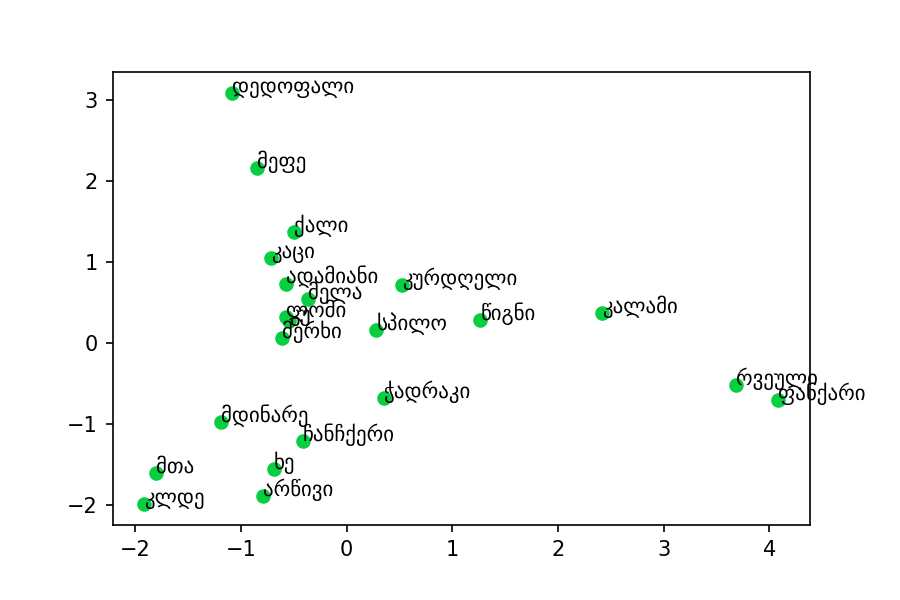
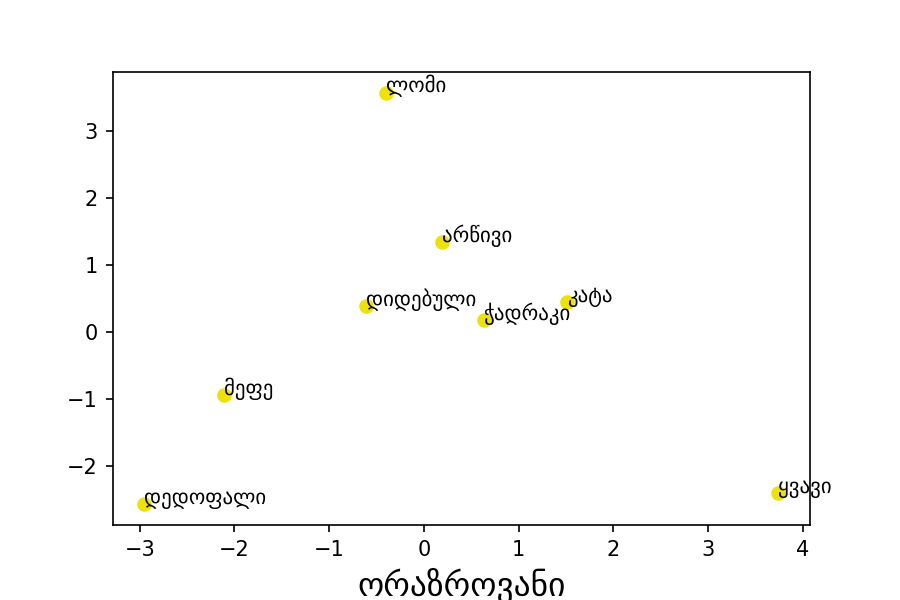
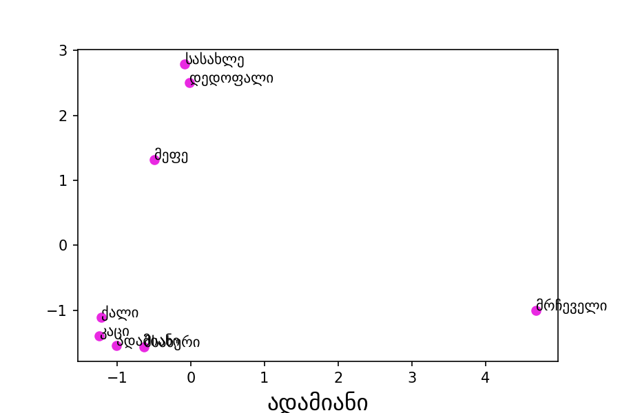
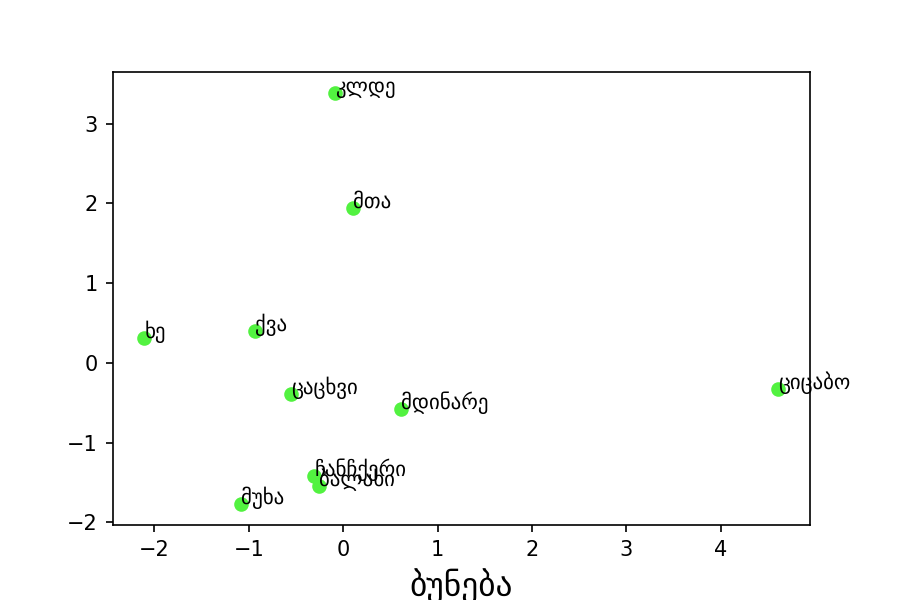
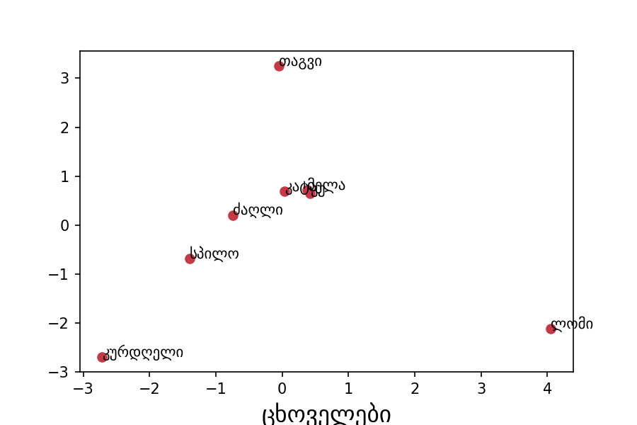

# NL3.14

## About
Georgian Text Specifics - NLP project to generate full Georgian text from given statements, or determine
similarities and dependencies between Georgian words. The project(NL3.14) included collecting Georgian
text data, format and save them CSV formats, generate word embedding vectors and use them in custom
tuning LSTM model. Built with Google Colab, Pytorch and Python(using numpy and pandas).

